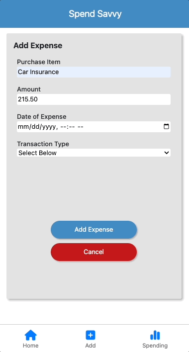
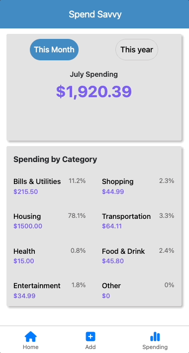

# spend-savvy

A full stack JavaScript application for individuals who want to track their spending habits.

## Why I Built This

Having never used an expense tracker before, I found the concept intriguing and decided to turn my curiosity into a useful application.

## Live Demo

Try the application live at [https://spend-savvy.herokuapp.com/]

## Technologies Used

- React.js
- Node.js
- Express
- PostgreSQL
- Webpack
- Babel
- JavaScript
- HTML5
- CSS3
- Bootstrap

## Features

- User can view their recent spending.
- User can add an expense.
- User can edit a recent spending expense.
- User can delete a recent spending expense.
- User can view total current month's spending.
- User can view total current year's spending.
- User can view spending by category.

## Preview





## Stretch Features

- User can create their own account and login.
- Users can view their spending from previous years, if available.

## Development

### System Requirements

- Node.js 18.12.0 or higher
- NPM 8.19.2 or higher
- PostgreSQL 14.5 or higher


### Getting Started

1. Clone the repository.

    ```shell
    git clone https://github.com/wang-morris/spend-savvy
    cd spend-savvy
    ```
2. Install all dependecies with NPM.

   ```shell
    npm install
    ```

3. Make a copy of the .env.example file.

    ```shell
    cp .env.example .env
    ```
4. Start the PostgreSQL database.

    ```shell
    sudo service postgresql start
    ```
4. Create the database name.

    ```shell
    createdb spendSavvy
    ```

5. Import the database schema.

    ```shell
    npm run db:import
    ```

5. Start the application. Once started, you can view the application by opening http://localhost:3000 in your browser.

     ```shell
    npm run dev
    ```
